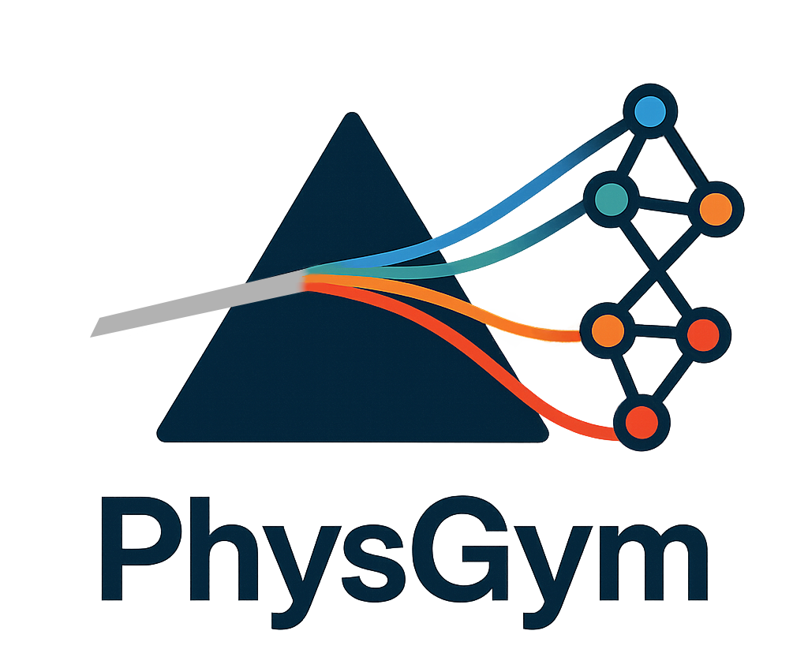

<p align="center">
  
</p>


<h3 align="center">Simulating Interactive Physics Discovery with Controlled Priors</h3>

<p align="center">
  <a href="https://arxiv.org/abs/2507.15550"></a>
  <a href="https://opensource.org/licenses/MIT"></a>
</p>

<p align="center">
A novel benchmark suite and simulation platform for rigorously assessing LLM-based scientific reasoning in interactive physics environments.
</p>

---

## 📢 News

- [Sep 2025] 🎉 PhysGym has been accepted to **NeurIPS 2025 Datasets and Benchmarks Track**! See you in San Diego.
- [Jul 2025] Paper released on [arXiv](https://arxiv.org/abs/2507.15550).

## Overview

PhysGym addresses a critical gap in evaluating AI scientific discovery capabilities: the inability to systematically control and vary the prior knowledge available to AI agents. Current benchmarks expose fixed sets of cues, making it impossible to distinguish between **memorization** and **true mechanistic inference**.

### The Core Challenge

Consider a pendulum experiment:
- With full context (variable names like "length", "gravity", descriptions), an agent can pattern-match to recover known solutions
- Without context (anonymized variables), the agent must actively probe the environment, design experiments, and form structural hypotheses

These scenarios involve identical physics but radically different cognitive demands—yet existing benchmarks cannot disentangle them.

### PhysGym's Solution

PhysGym provides **sophisticated control over prior knowledge levels**, allowing researchers to systematically investigate how LLM agents:
- Balance deductive reasoning (leveraging priors) with inductive learning (from experimentation)
- Adapt to unfamiliar problem settings
- Compensate for missing information through active exploration
- Construct and refine physics models from observations

## Key Features

- **Controlled Prior Knowledge (L1-L4)**: Systematically vary what contextual information agents receive, from full descriptions to completely anonymized variables
- **Interactive Physics Environments**: 97 curated physics problems from PHYBench, each with executable simulations
- **Realistic Constraints**: Limited experimental budgets (100 experiments) that mirror real scientific practice
- **Comprehensive Evaluation**:
  - **Success Rate**: Primary metric based on equation equivalence (symbolic + LLM-based)
  - **Consistency Metrics**: R², MSE, Kendall's tau, MAPE for hypothesis-data alignment
  - **Task Difficulty Metrics**: Equation complexity, variable count analysis
- **Complete History Tracking**: Monitor exploration dynamics, hypothesis evolution, and reasoning strategies

## Prior Knowledge Levels

PhysGym's central innovation is fine-grained control over prior information. Four primary levels are provided:

| Level | Context | Variable Descriptions | Variable Names | Use Case |
|-------|---------|----------------------|----------------|----------|
| **L1** | ✅ Full problem description | ✅ Physical meanings | ✅ Conventional (e.g., `m`, `v`) | Reasoning with rich priors |
| **L2** | ❌ "Unknown context" | ✅ Physical meanings | ✅ Conventional | Partial information |
| **L3** | ❌ Hidden | ❌ Meaningless descriptions | ✅ Conventional | Minimal semantic cues |
| **L4** | ❌ Hidden | ❌ Meaningless descriptions | ❌ Anonymous (`var_1`, `var_2`) | Pure equation discovery |

**Key Findings from Baseline Experiments:**
- Performance declines with reduced priors (e.g., o4-mini: 62.89% → 31% from L1 to L4)
- **Non-monotonic patterns**: Some problems solved only at lower prior levels, revealing conflicts between knowledge recall and discovery
- Prior knowledge becomes critical for high-dimensional problems (7+ variables)
- Reasoning-enabled models show better exploration dynamics under uncertainty

## Installation

### From Source (Development)

```bash
# Clone the repository
git clone https://github.com/principia-ai/PhysGym.git
cd PhysGym

# Install in editable mode
pip install -e .

# Or install with optional dependencies for local LLM support
pip install -e ".[local-llm]"

# Or install everything including dev tools
pip install -e ".[all]"
```

## Getting Started

### Configuration

1. Copy `api_keys.env.example` to `api_keys.env`
2. Add your API keys to `api_keys.env`:

### Quick Start: Basic Usage

```python
import physgym

# Create an experiment with a physics problem
experiment = physgym.ResearchInterface(
    env=285,           # Physics problem ID
    sample_quota=100,  # Maximum experiments
    mode="default"     # Prior level: "default" (L1), "no_context" (L2), 
                       # "no_description" (L3), "no_description_anonymous" (L4)
)

# Run experiments, test hypotheses, and evaluate
# See examples/basic_usage.py for complete walkthrough
```

For a complete example including experiment design, hypothesis testing, and metric evaluation, see [`examples/basic_usage.py`](examples/basic_usage.py).

For full benchmark evaluation with LLM agents, see [`experiments/run_baseline.py`](experiments/run_baseline.py) and the **Running Experiments** section below.

## Benchmark Components

### Dataset Structure

Each of the 97 physics problems is structured with:

```python
{
    "context": "Textual description of the physics problem",
    "solution": "Step-by-step derivation based on physics principles",
    "equation": "Ground-truth equation linking input/output quantities",
    "python_code": "Executable simulation with numerical validity checks",
    "input_variables": [
        {"name": "m", "description": "mass", "unit": "kg"},
        # ... more variables
    ],
    "output_variable": {"name": "v", "description": "velocity", "unit": "m/s"},
    "dummy_variables": ["Additional context variables not in core equation"]
}
```

### Architecture

```
PhysGym/
├── physgym/              # 📦 Core Benchmark Suite
│   ├── interface.py      # Research interface with quota management & prior control
│   ├── phyenv.py        # 97 executable physics environments
│   ├── samples/         # Complete problem dataset with metadata
│   ├── prompts/         # Evaluation & preprocessing prompts
│   └── utils/
│       ├── metrics.py    # R², MSE, Kendall's tau, symbolic equivalence
│       ├── llm_providers.py  # Multi-provider LLM support
│       ├── sandbox.py    # Safe execution environment
│       └── preprocess.py # Dataset construction tools
│
├── methods/              # 🔬 Baseline Agents
│   ├── baseline_researcher.py  # Direct prompting baseline
│   ├── react_agent.py          # ReAct-style agent
│   └── prompts/               # Agent-specific prompts
│
├── experiments/          # 🧪 Benchmark Runners
│   └── run_baseline.py   # Full evaluation across all problems & prior levels
│
├── analysis/            # 📊 Result Analysis
│   └── postprocess.py   # Aggregate metrics, identify patterns
│
└── examples/            # 📚 Usage Examples
    └── basic_usage.py
```

### Key Components

**Environments (`phyenv.py`)**:
- Access to the 97 physics environments (in full_samples.json) converted from PHYBench
- Each accepts numerical inputs and returns physics-based outputs
- Input validation and domain constraints included

**Interface (`interface.py`)**:
- **Quota Management**: Enforce experimental budget (default: 100 experiments)
- **Prior Knowledge Control**: Configure L1-L4 information exposure
- **History Tracking**: Complete logs of interactions, hypotheses, evaluations
- **Automatic Evaluation**: Integrated metrics for real-time assessment

**Evaluation Metrics (`utils/metrics.py`)**:
- **Success Rate**: Primary metric (symbolic + LLM-based equivalence)
- **Consistency Metrics**: R², MSE, Kendall's tau, MAPE

## Running Experiments

PhysGym provides several convenient scripts for running experiments. All scripts are located in the `scripts/` directory.

### Using Provided Scripts

**Quick Test (Single Problem)**
```bash
# Test on environment ID 285 with Gemini Flash
bash scripts/test.sh
```
Edit `scripts/test.sh` to customize the model, mode, and environment ID.

**Full Benchmark Evaluation (All 97 Problems)**
```bash
# Run complete benchmark with Gemini Pro
bash scripts/baseline.sh
```
Edit `scripts/baseline.sh` to change the model or mode.

**Local LLM with Ollama**
```bash
# Run with local Ollama model (e.g., gpt-oss:20b)
bash scripts/ollama_gpt.sh
```

**Local LLM Examples & Templates**
```bash
# View examples for running with Ollama, vLLM, etc.
bash scripts/run_local_llm_example.sh
```

### Direct Python Usage

**Single Problem**
```bash
python experiments/run_baseline.py \
    --env-id 285 \
    --mode default \
    --llm-model "google/gemini-2.5-flash" \
    --api-provider openrouter \
    --max-iterations 20 \
    --sample-quota 100
```

**All Problems (Batch)**
```bash
python experiments/run_baseline.py \
    --llm-model "google/gemini-2.5-flash" \
    --api-provider openrouter \
    --mode default \
    --idx-start 0 \
    --idx-end 97 \
    --sample-quota 100 \
    --max-iterations 20
```

### Prior Knowledge Modes

The `--mode` parameter controls the prior knowledge level:

- **`default`** → Level 1 (L1): Full context + descriptions + conventional names
- **`no_context`** → Level 2 (L2): No context, but descriptions + names available  
- **`no_description`** → Level 3 (L3): No context/descriptions, conventional names only
- **`no_description_anonymous`** → Level 4 (L4): Anonymized variables (var_1, var_2, etc.)

### Supported Models

PhysGym has been tested with:
- **OpenAI**: `openai/gpt-4`, `openai/o4-mini-high` (reasoning model)
- **Anthropic**: `anthropic/claude-3.7-sonnet`
- **Google**: `google/gemini-2.5-pro`, `google/gemini-2.5-flash`, `google/gemini-2.5-flash-preview:thinking`
- **DeepSeek**: `deepseek/deepseek-chat`, `deepseek/deepseek-r1`
- **Open Source** (via vLLM/Ollama): `Qwen3-32B`, `gpt-oss-20b`

For local models, use `--api-provider ollama` or `--api-provider vllm` with `--base-url` if needed.

## Scientific Discovery Workflow

PhysGym operationalizes the scientific discovery process:

```
┌─────────────────────────────────────────────────────────┐
│  1. Problem Setup                                       │
│     • Select physics environment (1-97)                 │
│     • Configure prior level (L1-L4)                     │
│     • Set experimental budget (default: 100)            │
└──────────────────┬──────────────────────────────────────┘
                   │
┌──────────────────▼──────────────────────────────────────┐
│  2. Active Experimentation                              │
│     • Agent designs experiments (input valuations)      │
│     • Environment returns observations                  │
│     • Budget decrements with each experiment            │
└──────────────────┬──────────────────────────────────────┘
                   │
┌──────────────────▼──────────────────────────────────────┐
│  3. Hypothesis Formation                                │
│     • Agent proposes equation based on observations     │
│     • Can request oracle test (symbolic equivalence)    │
│     • Receives consistency metrics (R², MSE, etc.)      │
└──────────────────┬──────────────────────────────────────┘
                   │
┌──────────────────▼──────────────────────────────────────┐
│  4. Iterative Refinement                                │
│     • Refine hypothesis based on feedback               │
│     • Design targeted experiments                       │
│     • Repeat until budget exhausted or solved           │
└──────────────────┬──────────────────────────────────────┘
                   │
┌──────────────────▼──────────────────────────────────────┐
│  5. Evaluation                                          │
│     • Success: Symbolic equivalence to ground truth     │
│     • Metrics: R², MSE, Kendall's tau, MAPE           │
│     • Analysis: Exploration dynamics, hypothesis count  │
└─────────────────────────────────────────────────────────┘
```

## Results Analysis

Process and analyze experiment results:

```bash
# Aggregate results and generate summary statistics
python analysis/postprocess.py

# Clean unsuccessful experiments (with remaining quotas)
python analysis/postprocess.py --clean
```

The script generates:
- `results_summary.json`: Aggregated metrics by model/configuration
- `models_data.json`: Detailed per-experiment data

For interactive exploration and visualization, refer to the notebook [`analysis/result_analysis.ipynb`](analysis/result_analysis.ipynb).

## Research Applications

PhysGym enables investigation of:

- **Curiosity-Driven Learning**: How agents explore to compress observations and improve world models
- **Prior vs. Posterior Balance**: When do agents rely on deduction vs. induction?
- **Experimental Design**: Can models design informative experiments or just random sampling?
- **Causal Reasoning**: Do models understand causal relationships or just correlations?
- **Generalization**: How do agents perform on unfamiliar problem representations?
- **Curriculum Learning**: Can progressive prior reduction improve discovery skills?

## Advanced Features

- **Flexible Prior Configuration**: Create custom prior levels beyond L1-L4
- **Multi-Modal Evaluation**: Both symbolic (SymPy) and LLM-based equivalence checking
- **Safe Execution**: Sandboxed environment for testing agent-generated code
- **Complete Provenance**: Full experiment history including failed hypotheses
- **Reproducible Benchmarking**: Deterministic evaluation with fixed random seeds
- **Extensible Architecture**: Easy integration of new agents and evaluation metrics

## Future Research Directions

PhysGym opens several promising avenues:

1. **Counterfactual Physics**: Create scenarios where memorized training data becomes a disadvantage, forcing models to rely on interactive reasoning
2. **Fine-Tuning for Discovery**: Investigate whether scientific reasoning skills can be learned through fine-tuning on low-prior tasks
3. **Enhanced Agent Design**:
   - Exploration modules that maximize information gain
   - Hypothesis falsification strategies
   - Automated curriculum learning using L1→L4 progression
4. **Knowledge Source Integration**: Identify crucial prior knowledge to develop agents that efficiently query external knowledge bases
5. **Multi-Agent Collaboration**: Coordinate specialized agents for different discovery phases

## Citation

If you use PhysGym in your research, please cite:

```bibtex
@article{chen2025physgym,
  title={PhysGym: Benchmarking LLMs in Interactive Physics Discovery with Controlled Priors},
  author={Chen, Yimeng and Pi\k{e}kos, Piotr and Ostaszewski, Mateusz and Laakom, Firas and Schmidhuber, J{\"u}rgen},
  journal={arXiv preprint arXiv:2507.15550},
  year={2025}
}
```

## Contributing

We welcome contributions! Areas of interest:

- **New baseline agents**: Implement novel discovery algorithms
- **Additional metrics**: Propose new evaluation dimensions
- **Environment extensions**: Add new physics problems or domains
- **Analysis tools**: Visualization and interpretation utilities
- **Documentation**: Tutorials, examples, and case studies

## License

This project is licensed under the MIT License.


---

**PhysGym** is designed to advance our understanding of AI scientific reasoning by providing a rigorous, controlled environment where both successes and failures illuminate the path toward truly autonomous scientific discovery agents.